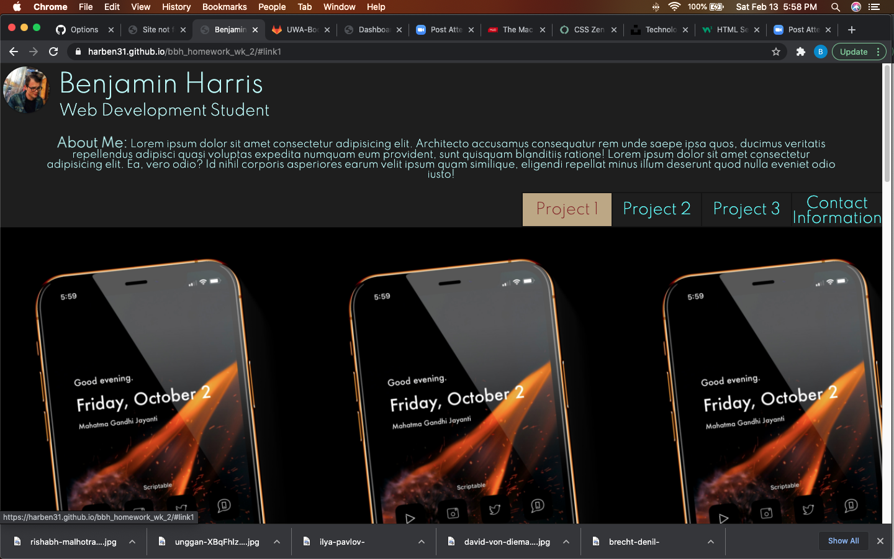
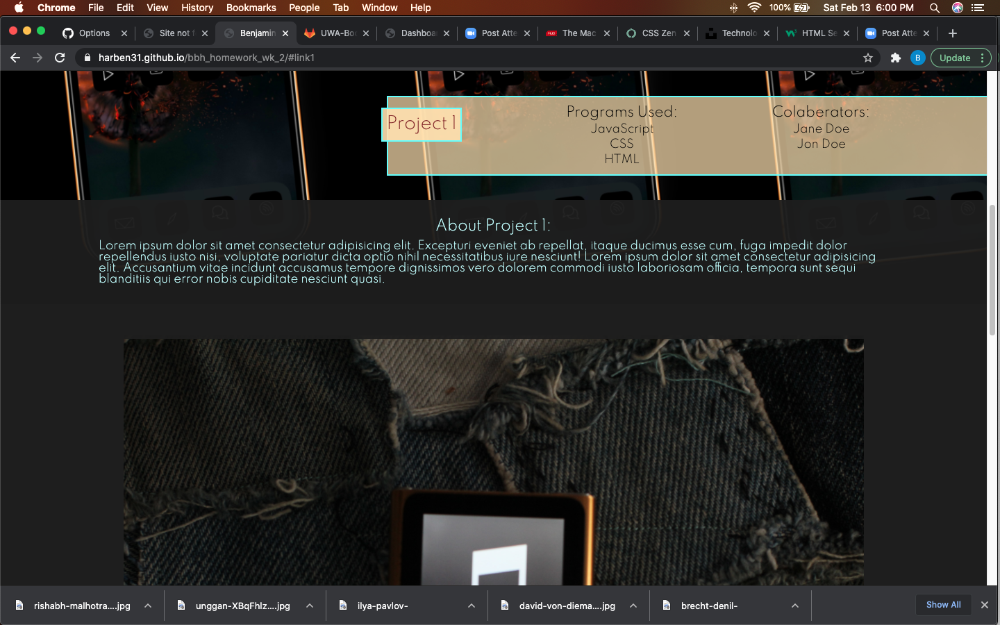
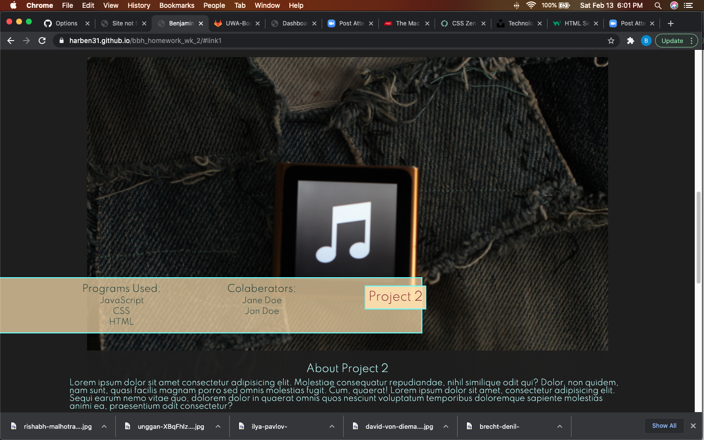
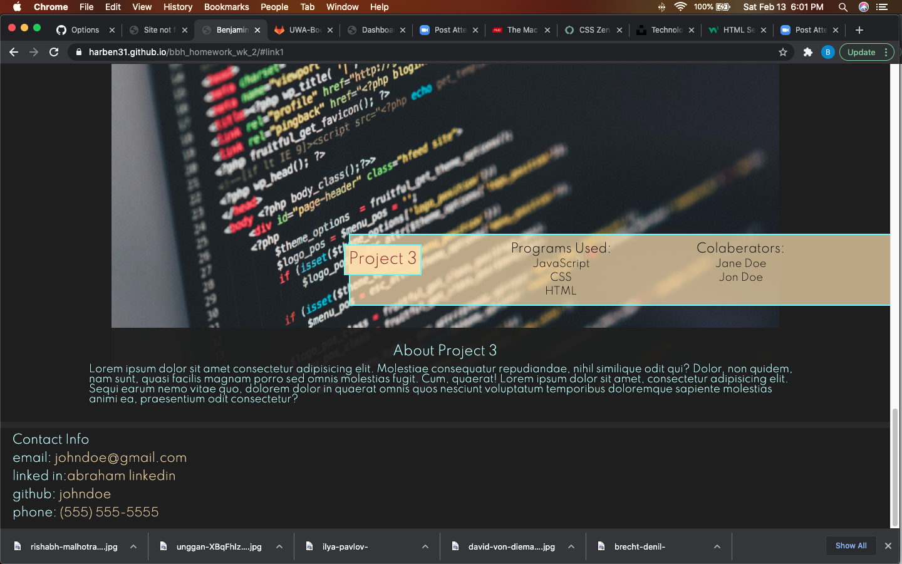

# bbh_homework_wk_2
Professional portofolio

This is the bare bones for my eventual professional portfolio. As of now it is filled with dummy links and stock photos (sources below). This site was created styled soley with CSS. Variables are declared at top of style.css. Site was designed from mobile up lowest pixel width considered was 320px. I plan on continuing to add to the style of this app as I learn more ways to manipulate a website. 

Deployed site: [deployed site](https://harben31.github.io/bbh_homework_wk_2/)

screenshots:

Photo credits: 

'iPhone' photo by <a href="https://unsplash.com/@rishmalho?utm_source=unsplash&amp;utm_medium=referral&amp;utm_content=creditCopyText">Rishabh Malhotra</a> on <a href="https://unsplash.com/t/technology?utm_source=unsplash&amp;utm_medium=referral&amp;utm_content=creditCopyText">Unsplash</a>

'iPod' photo by <a href="https://unsplash.com/@unggan?utm_source=unsplash&amp;utm_medium=referral&amp;utm_content=creditCopyText">Unggan</a> on <a href="https://unsplash.com/t/technology?utm_source=unsplash&amp;utm_medium=referral&amp;utm_content=creditCopyText">Unsplash</a>

'code' photo by <a href="https://unsplash.com/@ilyapavlov?utm_source=unsplash&amp;utm_medium=referral&amp;utm_content=creditCopyText">Ilya Pavlov</a> on <a href="https://unsplash.com/t/technology?utm_source=unsplash&amp;utm_medium=referral&amp;utm_content=creditCopyText">Unsplash</a>

[css reset coutesy of meyerweb.com](https://meyerweb.com/eric/tools/css/reset/)

